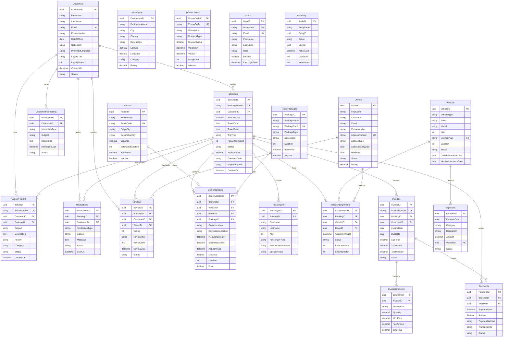

# Diagrama Entidad-Relación (ER) - Sistema NexionExplorTravel

## Diagrama de Relaciones Completo



---

## Módulos y sus Tablas

### 🔵 Módulo CRM (Azul)
- **Customers** (Centro del sistema)
- **CustomerInteractions**

### 🟢 Módulo Reservaciones (Verde)
- **Bookings** (Centro de operaciones)
- **BookingDetails**
- **Passengers**
- **VehicleAssignments**

### 🟡 Módulo Administración (Amarillo)
- **Vehicles**
- **Drivers**
- **Routes**
- **TravelPackages**
- **Destinations**

### 🔴 Módulo Contabilidad (Rojo)
- **Invoices**
- **InvoiceLineItems**
- **Payments**
- **Expenses**
- **PromoCodes**

### 🟣 Módulo Comunicación (Púrpura)
- **Notifications**
- **Reviews**
- **SupportTickets**

### ⚫ Módulo Sistema (Negro)
- **Users**
- **AuditLog**

---

## Flujo de Datos Principal

```
┌──────────────┐
│   Customer   │
│  (Cliente)   │
└──────┬───────┘
       │ 1. Crea
       ↓
┌──────────────┐
│   Booking    │
│ (Reservación)│
└──────┬───────┘
       │ 2. Genera
       ├──────────────────┬─────────────────┬──────────────┐
       ↓                  ↓                 ↓              ↓
┌─────────────┐  ┌──────────────┐  ┌─────────────┐  ┌─────────┐
│  Booking    │  │  Passengers  │  │   Vehicle   │  │ Invoice │
│  Details    │  │ (Pasajeros)  │  │ Assignment  │  │ (Factura)│
└─────────────┘  └──────────────┘  └──────┬──────┘  └────┬────┘
                                           │              │
                                      ┌────┴────┐         │ 3. Genera
                                      ↓         ↓         ↓
                                 ┌─────────┐ ┌────────┐ ┌─────────┐
                                 │ Vehicle │ │ Driver │ │ Payment │
                                 │(Vehículo)│ │(Chofer)│ │  (Pago) │
                                 └─────────┘ └────────┘ └─────────┘
```

---

## Cardinalidades Detalladas

### Relaciones 1:N (Uno a Muchos)

| Tabla Padre | Cardinalidad | Tabla Hija | Descripción |
|------------|--------------|------------|-------------|
| Customers | 1:N | Bookings | Un cliente puede tener múltiples reservaciones |
| Customers | 1:N | CustomerInteractions | Un cliente puede tener múltiples interacciones |
| Customers | 1:N | SupportTickets | Un cliente puede crear múltiples tickets |
| Bookings | 1:N | BookingDetails | Una reservación puede tener múltiples detalles |
| Bookings | 1:N | Passengers | Una reservación puede incluir múltiples pasajeros |
| Bookings | 1:N | Invoices | Una reservación puede generar múltiples facturas |
| Bookings | 1:N | Payments | Una reservación puede recibir múltiples pagos |
| Vehicles | 1:N | VehicleAssignments | Un vehículo puede tener múltiples asignaciones |
| Drivers | 1:N | VehicleAssignments | Un conductor puede tener múltiples asignaciones |
| Routes | 1:N | BookingDetails | Una ruta puede usarse en múltiples reservaciones |
| TravelPackages | 1:N | BookingDetails | Un paquete puede venderse múltiples veces |
| Invoices | 1:N | InvoiceLineItems | Una factura puede tener múltiples líneas |

### Relaciones 1:1 (Uno a Uno)

| Tabla A | Cardinalidad | Tabla B | Descripción |
|---------|--------------|---------|-------------|
| Bookings | 1:1 | VehicleAssignments | Cada reservación tiene una asignación de vehículo |

---

## Índices Importantes por Tabla

### Alto Tráfico de Consultas:

**Bookings:**
- `IX_Bookings_TravelDate` - Búsquedas por fecha de viaje
- `IX_Bookings_Status` - Filtros por estado
- `IX_Bookings_Customer` - Historial de cliente

**Payments:**
- `IX_Payments_Date` - Reportes financieros
- `IX_Payments_Status` - Seguimiento de pagos
- `IX_Payments_TransactionID` - Referencias externas

**Invoices:**
- `IX_Invoices_Date` - Reportes de facturación
- `IX_Invoices_Status` - Facturas pendientes
- `IX_Invoices_Customer` - Historial del cliente

**VehicleAssignments:**
- `IX_VehicleAssignments_Date` - Programación de vehículos
- `IX_VehicleAssignments_Vehicle` - Utilización de vehículo
- `IX_VehicleAssignments_Driver` - Agenda del conductor

---

## Constraints de Integridad

### Check Constraints por Tabla:

**Customers:**
- `Status IN ('Active', 'Inactive', 'Blocked')`
- `LoyaltyTier IN ('Bronze', 'Silver', 'Gold', 'Platinum')`

**Bookings:**
- `Status IN ('Pending', 'Confirmed', 'Cancelled', 'Completed')`
- `PaymentStatus IN ('Pending', 'Partial', 'Paid', 'Refunded')`
- `TripType IN ('OneWay', 'RoundTrip', 'MultiDestination')`

**Passengers:**
- `PassengerType IN ('Adult', 'Child', 'Infant', 'Senior')`

**Vehicles:**
- `Status IN ('Available', 'InService', 'Maintenance', 'Retired')`
- `VehicleType IN ('Bus', 'Van', 'Car', 'Luxury', 'SUV')`

**Drivers:**
- `Status IN ('Active', 'OnLeave', 'Suspended', 'Terminated')`
- `Rating BETWEEN 0 AND 5`

**Reviews:**
- `Rating BETWEEN 1 AND 5`

---

## Campos Calculados Recomendados

### En Aplicación (No en BD):

1. **Bookings.NetAmount** = `TotalAmount - (SELECT SUM(Amount) FROM Payments WHERE BookingID = @BookingID)`
2. **Bookings.DaysUntilTravel** = `DATEDIFF(day, GETDATE(), TravelDate)`
3. **Invoices.AmountDue** = `TotalAmount - (SELECT SUM(Amount) FROM Payments WHERE InvoiceID = @InvoiceID)`
4. **Invoices.DaysOverdue** = `DATEDIFF(day, DueDate, GETDATE())` (si > 0)
5. **Vehicles.DaysSinceLastMaintenance** = `DATEDIFF(day, LastMaintenanceDate, GETDATE())`
6. **Customers.TotalSpent** = `SUM(Bookings.TotalAmount)`
7. **Drivers.CompletionRate** = `(CompletedTrips / TotalAssignments) * 100`

---

## Campos JSON Sugeridos

Algunos campos almacenan datos en formato JSON para flexibilidad:

**Routes.Stops** (Ejemplo):
```json
[
  {
    "order": 1,
    "location": "Terminal Central",
    "stopTime": 10
  },
  {
    "order": 2,
    "location": "Plaza Mayor",
    "stopTime": 5
  }
]
```

**TravelPackages.IncludedServices** (Ejemplo):
```json
{
  "transport": true,
  "meals": 2,
  "accommodation": "Hotel 4 estrellas",
  "guide": true,
  "insurance": "Básica"
}
```

**TravelPackages.Destinations** (Ejemplo):
```json
[
  {
    "destinationId": "uuid-here",
    "nights": 2,
    "activities": ["Tour de ciudad", "Visita museo"]
  }
]
```

---

## Triggers Implementados

### 1. `trg_Customers_UpdateModifiedOn`
- **Tabla:** Customers
- **Evento:** AFTER UPDATE
- **Acción:** Actualiza automáticamente el campo `ModifiedOn` al modificar un registro

### 2. `trg_Bookings_UpdateModifiedOn`
- **Tabla:** Bookings
- **Evento:** AFTER UPDATE
- **Acción:** Actualiza automáticamente el campo `ModifiedOn` al modificar una reservación

### Triggers Adicionales Recomendados:

3. **trg_Payments_UpdateBookingStatus**
   - Actualizar automáticamente `PaymentStatus` en Bookings cuando se registra un nuevo pago

4. **trg_VehicleAssignment_CheckAvailability**
   - Validar que vehículo y conductor estén disponibles antes de asignar

5. **trg_Booking_CalculateLoyaltyPoints**
   - Calcular y asignar puntos de lealtad cuando una reservación se completa

---

## Vistas Implementadas

### 1. vw_ActiveBookings
Muestra todas las reservaciones activas con información completa de cliente, vehículo y conductor.

**Campos principales:**
- BookingNumber, TravelDate, Status
- CustomerName, CustomerEmail, CustomerPhone
- TotalAmount, PaymentStatus
- VehicleName, LicensePlate
- DriverName

**Uso:** Dashboard operativo, seguimiento de reservaciones

---

### 2. vw_RevenueReport
Reporte de ingresos agrupado por mes y moneda.

**Campos principales:**
- Year, Month
- TotalBookings
- TotalRevenue, CurrencyCode
- AvgBookingValue

**Uso:** Reportes financieros, análisis de tendencias

---

### 3. vw_VehicleUtilization
Estadísticas de uso por vehículo.

**Campos principales:**
- VehicleName, LicensePlate, VehicleType
- TotalAssignments, CompletedTrips
- AvgTripDuration

**Uso:** Optimización de flota, mantenimiento preventivo

---

### 4. vw_CustomerLoyalty
Perfil completo de lealtad del cliente.

**Campos principales:**
- CustomerName, Email
- LoyaltyTier, LoyaltyPoints
- TotalBookings, TotalSpent
- LastBookingDate, AvgRating

**Uso:** Marketing, programa de lealtad, CRM

---

### 5. vw_PendingPayments
Facturas pendientes y vencidas.

**Campos principales:**
- InvoiceNumber, InvoiceDate, DueDate
- DaysOverdue
- TotalAmount, CurrencyCode
- CustomerName, Email, PhoneNumber
- BookingNumber

**Uso:** Gestión de cobranza, seguimiento de pagos

---

## Casos de Uso Principales

### 1. Crear una Nueva Reservación

```sql
-- Paso 1: Crear la reservación
EXEC sp_CreateBooking 
    @CustomerID = 'customer-uuid',
    @TravelDate = '2025-12-25',
    @TravelTime = '08:00',
    @TripType = 'RoundTrip',
    @PassengerCount = 4,
    @TotalAmount = 1200.00,
    @CurrencyCode = 'USD',
    @BookingID = @NewBookingID OUTPUT,
    @BookingNumber = @NewBookingNumber OUTPUT;

-- Paso 2: Agregar detalles
INSERT INTO BookingDetails (...);

-- Paso 3: Agregar pasajeros
INSERT INTO Passengers (...);

-- Paso 4: Asignar vehículo y conductor
INSERT INTO VehicleAssignments (...);
```

### 2. Procesar un Pago

```sql
-- Procesar pago y actualizar estado automáticamente
EXEC sp_ProcessPayment
    @BookingID = 'booking-uuid',
    @Amount = 600.00,
    @PaymentMethod = 'CreditCard',
    @TransactionID = 'txn-12345',
    @PaymentID = @NewPaymentID OUTPUT;
```

### 3. Consultar Reservaciones de un Cliente

```sql
SELECT * FROM vw_ActiveBookings
WHERE CustomerEmail = 'cliente@email.com'
ORDER BY TravelDate DESC;
```

### 4. Generar Reporte de Ingresos Mensual

```sql
SELECT * FROM vw_RevenueReport
WHERE Year = 2025 AND Month = 11
ORDER BY CurrencyCode;
```

---

## Notas de Implementación

1. **IDs**: Todos los IDs son de tipo GUID (UNIQUEIDENTIFIER) para evitar colisiones
2. **Fechas**: Usar DATETIME para timestamps, DATE para solo fechas
3. **Monedas**: Almacenar código de moneda (ISO 4217) en cada transacción
4. **Soft Delete**: Considerar agregar campos `IsDeleted` en lugar de eliminar físicamente
5. **Auditoría**: La tabla AuditLog registra todos los cambios importantes
6. **Encriptación**: Campos sensibles deben encriptarse a nivel de aplicación o BD
7. **Timezone**: Todas las fechas en UTC, convertir en aplicación según zona del usuario

---

*Última actualización: 8 de Noviembre, 2025*
